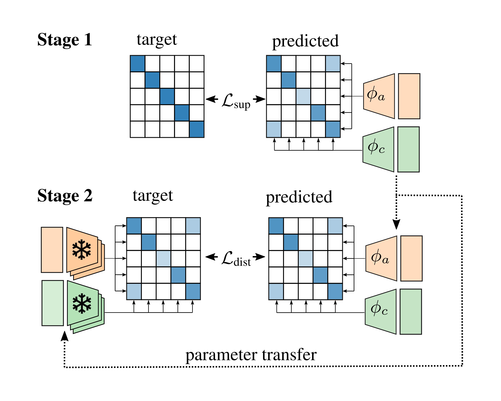

# Estimated Audio–Caption Correspondences Improve Language-Based Audio Retrieval

**DISCLAIMER**: Work in progress :construction_worker: :hammer: :nut_and_bolt:

This repository contains the implementation of [[1]](#1), which we submitted to the DCASE Workshop 2024 and which is currently under review.

Our submission [[2]](#2) to the DCASE Challenge 2024 based on the proposed method, took the first rank in [task 8](https://dcase.community/challenge2024/task-language-based-audio-retrieval) [[3]](#3).

## Motivation: Missing Audio–Caption Correspondences

Audio retrieval systems are typically trained on audio–caption datasets (e.g., ClothoV2 [[4]](#4)), which contain pairs of audios and corresponding descriptions $\\{ (a_i, c_i)\\}_{N=1 \dots N}$.
Unfortunately, for these datasets, the pairwise correspondence between audio $i$ and caption $j$ is not known for the case $i \neq j$; it is therefor common practice (e.g., during contrastive training and during evaluation) to assume that those pairs do not match.

However, relying on this assumption is not ideal. The following paragraph show a query and the five best-matching audio recordings in the ClothoV2 test set according to our retrieval model. 
- Recordings marked with :white_check_mark: are associated with the description ($i = j$), whereas 
- recordings marked with :grey_question: are associated with another caption ($i \neq j$); we thus do not know if the caption describes the audio.

(Hint: Use CLTR + click to open the recording in a new tab)

**Query:** A large gathering of people are talking loudly with each other. \
**Results:** <a href='https://freesound.org/people/ivolipa/sounds/344952' target='_blank'>rank 1</a> :grey_question:, <a href='https://freesound.org/people/cognito perceptu/sounds/57595' target='_blank'>rank 2</a> :grey_question:, <a href='https://freesound.org/people/dobroide/sounds/352819' target='_blank'>rank 3</a> :grey_question:, <a href='https://freesound.org/people/northern87/sounds/88530/' target='_blank'>rank 4</a> :grey_question:, <a href='https://freesound.org/people/HBSA/sounds/158513' target='_blank'>rank 5</a> :white_check_mark:

All audio recordings marked with :grey_question: actually match the description, and should not be treated as non-matching audio recordings during training.
We thus argue that additional correspondence annotations are required to give better guidance during training.

## Estimating Audio–Caption Correspondences

Since there are (currently) no large-scale datasets with partial or complete correspondence annotations, we estimate them with one or multiple other audio-retrieval models.  

The figure below illustrates the procedure:
<p align="center">

</p>

In **stage 1**, we assume that audio $a_i$ and caption $c_j$ do not match if $i \neq j$ and train the model with contrastive loss $L_{\textrm{sup}}$.

**Stage 2** uses predictions ensembled from several Stage 1 models (bottom left) to estimate the correspondence between $a_i$ and $c_j$; those estimates then serve as prediction targets instead of the ground truth from stage 1. 
Stage 2 model parameters are initialized with stage 1 parameters, and the corresponding loss is denoted as $L_{\mathrm{dist}}$.

## Setting up the environment

The following is a description on how to set up a conda environment on Ubuntu 18.04 for training and inference. 

Create environment:
- `conda env create -f environment.yml`
- `conda activate salsa`
- `CFLAGS='-O3 -march=native' pip install https://github.com/f0k/minimp3py/archive/master.zip`

Activate the environment:
- `conda activate salsa`

## Test our pre-trained model on the ClothoV2 benchmark

Download ClothoV2 [[4]](#4):
- run `scripts/download_clothov2.sh`
- the script downloads the dataset into a folder called `clothov2`


A checkpoint of the model is available here: 
https://cloud.cp.jku.at/index.php/s/ZZkWXQ7f3aXRXYW

Download and ensemble the checkpoint with this command:
- run `scripts/download_checkpoint.sh`

And then, use this command to test on the ClothoV2 benchmark
```
CUDA_VISIBLE_DEVICES=0 python -m experiments.ex_dcase24 cmd_test_on_clothov2 with \
data_loader.batch_size_eval=32 \
audio_features.segment_length=10 \
audio_features.model=passt \
sentence_features.model=roberta-large \
load_model=passt_roberta.ckpt \
directories.data_dir=.
```

## Training

Training was done on a single Nvidia A40 GPU.

Stage 1 training:
```
CUDA_VISIBLE_DEVICES=0 python -m experiments.ex_dcase24 with \
data_loader.batch_size=64 \
data_loader.batch_size_eval=32 \
audio_features.segment_length=10 \
audio_features.model=passt \
sentence_features.model=roberta-large \
rampdown_type=cosine \
max_epochs=20 \
rampdown_stop=15 \
warmup_length=1 \
rampdown_start=1 \
train_on=clothov2 \
seed=409194
```
The result will be stored in the `model_checkpoints` directory.

Estimate correspondences (replace `mild-mountain-1` with the experiment name); the results are stored in the same directory as the checkpoint:
```
MODEL_NAME=mild-mountain-1
CUDA_VISIBLE_DEVICES=0 python -m experiments.ex_dcase24 cmd_generate_embeddings with \
data_loader.batch_size_eval=32 \
audio_features.segment_length=10 \
audio_features.model=passt \
sentence_features.model=roberta-large \
load_parameters=$MODEL_NAME
```

Stage 2 training:
```
MODEL_NAME=mild-mountain-1
CUDA_VISIBLE_DEVICES=0 python -m experiments.ex_dcase24 cmd_test_on_clothov2 with \
data_loader.batch_size=64 \
data_loader.batch_size_eval=32 \
audio_features.segment_length=10 \
audio_features.model=passt \
sentence_features.model=roberta-large \
lr_audio_encoder=2e-5 \
lr_audio_project=2e-5 \
lr_sentence_encoder=2e-5 \
lr_sentence_project=2e-5 \
rampdown_type=cosine \
max_epochs=20 \
rampdown_stop=15 \
warmup_length=1 \
rampdown_start=1 \
train_on=clothov2 \
load_parameters=$MODEL_NAME \
load_last=best \
loss_weight=0.0 \
distill_weight=1.0 \
distill_from=m$MODEL_NAME \
seed=144272510
```

### Additional Datasets

To achieve state-of-the-art, the system needs to be trained on ClothoV2, AudioCaps, and WavCaps. 

First, download WavCaps [[5]](#5):
- run `scripts/download_wavcaps.sh`
- the script downloads the dataset into a folder called `wavcaps`

Then download AudioCaps [[6]](#6):
- unfortunately, audio recordings of AudioCaps are not publicly available
- you can download the data set yourself or reach out to me for the download link (for research purposes only)
- replace the links in `scripts/download_audiocaps.sh`
- run `scripts/download_audiocaps.sh`
- the script downloads the compressed dataset into a folder called `tmp`

Finally, set flag `train_on=all` in stage 1 (`train_on=clothov2` in stage 2) and repeat the training procedure described above.

### References
- [1] P. Primus, F. Schmid, and G. Widmer, “Estimated Audio--Caption Correspondences Improve Language-Based Audio Retrieval”, under review
<a name="1"></a>
- [2] P. Primus, and G. Widmer, “A Knowledge Distillation Approach to Improving Language-Based Audio Retrieval Models,” DCASE2024 Challenge, Tech. Rep., June 2024
<a name="2"></a>
- [3] H. Xie, S. Lipping, and T. Virtanen, "Language-Based Audio Retrieval Task in DCASE 2022 Challenge", in Proc. of the Detection and Classification of Acoustic Scenes and Events Workshop, DCASE, Nancy, France, 2022
<a name="3"></a>
- [4] K. Drossos, S. Lipping, and T. Virtanen, “Clotho: an Audio Captioning Dataset,” in Proc. of the IEEE Int. Conf. Acoustic., Speech and Signal Process., ICASSP, Barcelona, Spain, 2020
<a name="4"></a>
- [5] X. Mei, C. Meng, H. Liu, Q. Kong, T. Ko, C. Zhao, M. D. Plumbley, Y. Zou, and W. Wang, “WavCaps: A ChatGPT-assisted weakly-labelled audio captioning dataset for audio-language multimodal research,” CoRR, vol. abs/2303.17395, 2023.
<a name="5"></a>
- [6] C. D. Kim, B. Kim, H. Lee, and G. Kim, “AudioCaps: Generating captions for audios in the wild,” in Proc. of the North American Ch. of the Ass. for Computational Linguistics: Human Language Technologies, NAACL-HLT, 2019.
<a name="6"></a>